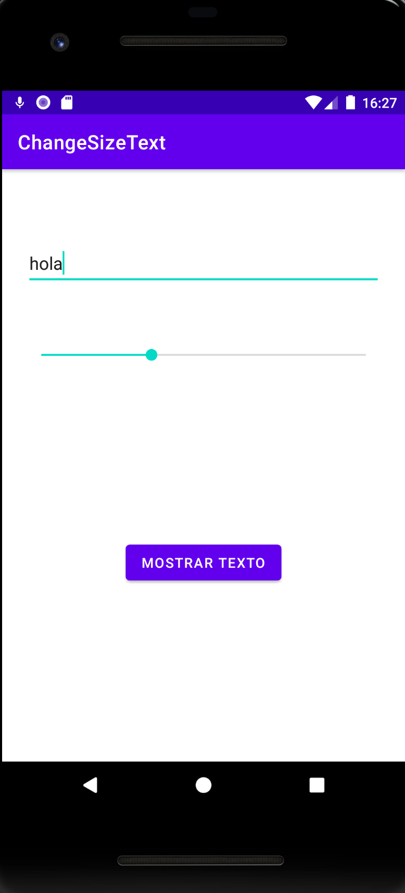

<h1>Ejercicio ChangeSizeText</h1>

Con este proyecto lo que quiero conseguir es poder mandar un texto con una fuente elegida por el usuario a otra activity.

Para esto he usado una clase POJO, llamada [Message](app/src/main/java/com/jesusc24/changesizetext/data/model/Message.java) para poder crear el mensaje y poder pasar ese objeto de una activity a otra. También tengo un POJO de la clase
[User](app/src/main/java/com/jesusc24/changesizetext/data/model/User.java)  para que se sepa en todo momento que usuario está realizando esa acción.

La activity [ChangeSizeText](app/src/main/java/com/jesusc24/changesizetext/ui/ChangeSizeTextActivity.java) muestra un EditText para poder escribir el texto y una SeakBar para elegir entre el tamaño de letra 0 y 100. Esta información
se le mando a la activity [ViewMessage](app/src/main/java/com/jesusc24/changesizetext/ui/ViewMessageActivity.java) para que muestre el texto en el tamaño de fuente elegido.

Hay que destacar la clase [ChangeSizeApplication](app/src/main/java/com/jesusc24/changesizetext/ChangeSizeApplication.java) que se encarga de que el usuario sea conocido por el resto de las activitys.

Gracias a las propiedades de View, en la activity ChangeSizeText se mantiene la información introducida aunque se haya destruido la activity por una
rotación del dispositivo o por otras razones.

Imagen de la primera <code>Activity</code> de mi aplicación, que es donde se tiene que poner el texto
y el tamaño de la fuente: 

Imagen de la segunda <code>Activity</code> de mi aplicación, que es donde se muestra el texto con el tamaño
de la fuente definido por el usuario

